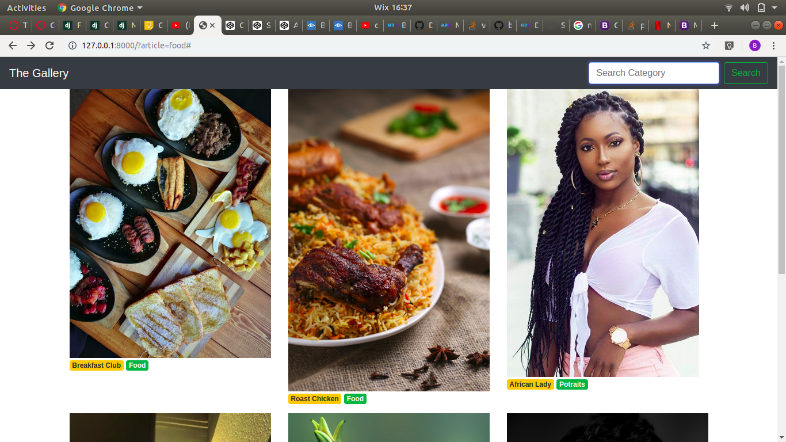

# PHOTOGALLERY

This is a site that allows users to view photos according to location and category

## Author name

Beryl Onyancha

## Technologies Used

Python 3.6

Django 2.2.1

## Application requirements

1. Ensure you have Python3.6 installed in your computer. you can download it by running this command

`$ sudo apt-get update sudo apt-get install python3.6.`

2. Ensure you have PiP installed in your computer, you can download it by running this command:

`$ python get-pip.py`

3. set up a virtual environment using the following command;

`$ python3.6 -m venv --without-pip virtual`

4. Run the following command to install all your dependencies in your local computer;

`$ pip install -r requirements.txt`

## Project setup instruction/ installations

1. From the repository, click + in the global sidebar and select Clone this repository .

2.  Copy the clone command.

3.  From a terminal window, change to the local directory where you want to clone your repository.

4. Run this command to open the app

`$ python3.6 manage.py runserver`

## BDD

| Behavior        | Result |
| ------------- |:----:|
| user loads the page | all  images are displayed |
| user clicks on an image that interests his/her | the image is enlarged in a modal and its Description, Location and Category is shown |
| user clicks on the copy link button | the image url is copied and an alert is displayed |
| user searches for an image category or location  | user is re-directed to the searched term with relevant images displayed |

## Live link

Use this link to see the web-page
https://beesgallery.herokuapp.com

#### Known bugs
Search by category is not functional

## Contact Information

Email: berylonyancha@gmail.com

## Screenshot

## License

MIT License [MIT](https://github.com/berylonyancha/mygallery/blob/master/LICENSE)

Copyright (c) [2019] [BERYLONYANCHA]

